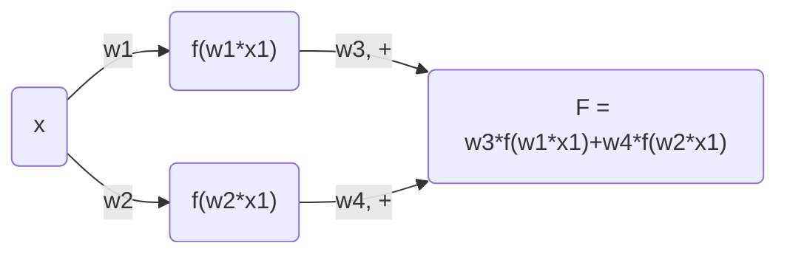

# 深度学习笔记（旧）

这都是我一年前的笔记了，记的都是一些特别简单的东西，之后再修改可能就需要大幅删减，还不如重新写一篇。为了纪念，我把这篇文章传到博客上保存，以后就再写一篇新的。

[TOC]

## 前置知识

一下子就跳到梯度下降并不是很合适，在这里记录一些比较重要的前置数学知识，和一些简单的编程原则。

### 矩阵乘法

记住矩阵乘法的一个核心原则，告诉你什么时候应该转置一个矩阵再去和另一个矩阵相乘，而什么时候不需要。一个n行m列的**矩阵形状**为$(n，m)$，假设矩阵A和矩阵B要相乘，那么在形状上的表现应当为$(a, b)\times (b, c) = (a, c)$。即第一个矩阵的列和第二个矩阵的行一定要相等！

而从这一点我们又可以去推出，矩阵乘法本质上是一堆向量之间的点乘批量执行。得到的矩阵C，其第n行、第m列的元素值，就应该为A矩阵中第n行、B矩阵中第m列点乘的结果。

### 一些记号

针对于二元回归模型：


## 梯度下降基本原理

请想象这样一个场景：你正在进行一个化学实验，其中有一个环节就是用量气筒测定产生气体的体积。为了保证读数准确，你需要调整量气筒的高度，使其两边的液面高度相同。现在右侧液面高于左侧，到底是抬高右管，还是应该放低右管呢？我猜你一定会这么做：先试着抬高右管，观察两侧液面高度差是否减小。如果减小了，那就一直抬高直至两侧液面相平；如果高度差反而增大，那就会向下移动右管，直到高度差为零。


这样做并不是什么了不起的事情。我们可以把这个过程叫做“冷热学习法”或者“反馈调节”，在不断的试错过程中不断逼近正确答案。人可以这么做，而机器更可以！事实上，把刚才的方法稍加改动，就是深度学习里的梯度下降过程了。我们需要**梯度下降**，因为它可以帮助我们找到最适合模型做出准确预测的那一组参数，使预测的结果与实际值的误差尽可能小，它是深度学习理论的基石。

**检测高度差**：所以，如果想在自己的模型上使用梯度下降方法，需要先用**损失函数**来衡量模型预测的误差。我们先考虑最简单最具体的（也没有什么意义的）一个预测模型，给定`input`和`weight`，随后输出预测值`pred=input*weight`，然后在试错中努力调整weight，使之符合最初给定的目标值`goal_pred`。也许你就会想，一个除法不就解决了吗？那假如从`input`到最终的预测结果需要经过很多步计算呢？如果`weight`和`input`都有很多个值呢？矩阵和向量之间可都是没有除法的！我们正在研究一个梯度下降的通式。代码表示如下：

```python
inp = 2
weight = 0.5
goal_pred = 0.5
```

然后我们把损失函数设定为$C=(goal\_pred-pred)^2$。这样我们的误差就可以始终保持正数，并且让大的误差变得更大，忽略那些微不足道的误差。更关键的一点是，这个函数只有一个极小点，所以我们可以确保能够找到这个误差函数的唯一最小值，零。

**移动量气筒**：而接下来我们要想办法调整`weight`的值来使之拟合`goal_pred`。这就用到了梯度下降法：根据我们刚才定义的损失函数，且我们只能改变`weight`的值，可以判断出误差`C`是关于`weight`的一个二次函数。而梯度下降法的精髓就在于，**通过求损失函数在该weight处值的斜率（导数）来确定调整误差”步长”的大小和方向。**

**看“高度差”的变化趋势**：为什么要求损失函数的导数呢？因为注意到这个二次函数的值是我们的误差，我们最终想让损失函数的值最小，也就是让导数接近于零。这里，想要减少导数，那就利用函数在这个点的导数最合适不过了，因为它同时告诉了我们两件事：往哪个方向调整，以及调整多少。导数的几何意义就是指一个点处该函数切线的斜率，如果斜率是正的，说明我们增大权重，误差也会随之增加，如果斜率是负的，增大权重，误差就会减小。看见了吗？所以我们总是要用原来的权重减去梯度（导数），来得到修正之后的权重。导数越大，说明误差越大，调整的也需要越多。

**做出行动**：因此，我们往往使用代码`weight-=alpha*derivative`来往正确的方向调整权重的值。而这个斜率怎么求呢？因为误差函数是一个简单的二次函数，我们可以用一点数学方法，为了表示更加简便，令$i=input, w=weight, g=goal\_pred$。则$C=g^2+i^2w^2-2giw$，其中g和i都可以被看作为常数。那么导数就是$C'=2i^2w-2gi=2i(i\times w-g)$。然后我们发现`i*w`就是我们的`pred`，所以我们最后对weight的改变就可以写成

```python
weight-=alpha*(pred-goal_pred)*input
```

其中alpha是学习率，防止过度调试。

那我们如何根据这个例子进行推广呢？如果有不止一个参数，那就分别计算每一个参数的偏导数（没有想象的那么复杂，就是把其他的变量“冻结”成常数，然后再求导）。比如最终的计算结果是

$$
\hat y = w_1x_1+w_2x_2+b
$$
其中$\hat y$代表我们的`prediction`。那么对于$w_1$来说其关于$\hat y$的导数就是$x_1$。

本质上，梯度下降就是用这两个公式：
$$
w=w-\frac{\partial J(w,b)}{\partial w}\\
b=b-\frac{\partial J(w,b)}{\partial b}
$$


## 最简单的神经网络：逻辑回归

Logistic regression，听上去高大上，实际上就是一种二元分类问题。逻辑回归模型接受一组输入，然后产生的输出是0或1。那我们想一想这个神经网络的架构，包含输入、权重和输出。可是让输入乘以权重得到的结果可能是从负无穷到正无穷的任意值，我们如何判断机器分类到底是“0”还是“1”呢？同样，如果函数的值域无穷大，我们如何判断一个函数做出的判断是否准确呢？难道是越接近正无穷或者负无穷，模型就越准确吗？这是很难量化的。所以我们就引入了`sigmoid`函数让从负无穷到正无穷内的所有数都被压缩到（0，1）的值域之间。


数学符号：$\sigma$。

函数表达式：$\LARGE \sigma(x)=\frac{1}{1+e^{-x}}$

导数：$\large \sigma'(x)=\sigma(x)\times (1-\sigma(x))$

对于用`sigmoid`处理的预测函数，与MSE方法相比，一种更科学地计算误差的方法，是使用如下的公式（前提是pred已经使用了sigmoid函数）：

$\large loss(pred, goal) = -(goal\times log(pred)+(1-goal)\times log(1-pred))$

看上去很复杂，难以理解，其实就是交叉熵的一种简单的形式，没啥难的，不就是负对数吗？


如果这样做，误差函数的曲线就会比较平滑，如果采用MSE方法，则会产生许多局部最优的情况，不利于模型收敛。我的理解是，这样的损失函数的值域范围有限，肯定是会出问题的，一个真正合适的损失函数，可以取到的范围一定是从零到无穷大而不是从零到一。所以损失函数采用了对数的形式。


有趣的是，设最初答案$\large z=w\times x+b$，而z对于最终损失函数的导数为$\large \sigma(z)-goal$。格外地，对于权重w来说还需要把这个导数额外再乘以x，**这是一个类似于反向传播的过程。**所以我们需要对于初始权重所做的改变量永远是`input*derivative`，和上文用纯数学导数推导出来的结果相同。

我们这个神经网络其实只有一层，对输入进行线性变换之后，用sigmoid函数进一步处理才得到输出。我们把sigmoid函数称为，这个神经网络输出层的**激活函数**。关于激活函数的更多内容，以后还会提到。

## 实例：识别交通信号灯

假设有如下数据集，第一个数组`lights`有6个元素，每个元素表示三个信号灯的亮、灭情况；第二个数组`cango`代表能否通行。然后需要设计一个简单的程序来判断不同灯光的组合与能否通行之间的关系。

```python
import numpy as np
lights = np.array([[1, 0, 1], [0, 1, 1], [0, 0, 1], [1, 1, 1], [0, 1, 1], [1, 0, 1]])
cango = np.array([0, 1, 0, 1, 1, 0])
```

肯定用到的算法还是梯度下降（好像还有点逻辑回归）。以我们之前的知识（单层神经网络）能够轻松解决这个问题，因为实际上能否通行只和中间一个灯的亮灭情况有关！与之前情境有些不同的是，这次是要对多组数据进行训练，且每一次有多个输入。这都不是问题，梯度下降的代码是可以通用的：

```python
weights = np.array([0.5, 0.3, -0.8])
for i in range(40):
    for now in range(len(cango)):
        inp = lights[now]
        goal_pred = cango[now]
        pred = inp.dot(weights)
        weights -= 0.1*(pred-goal_pred)*inp;
```

就7行代码，非常简单！首先，我们让机器重复学习这组数据集40次，对于多个数据，我们就对其进行点乘求和（类似于加权），然后就是十分眼熟的梯度下降代码调整权重。运行完之后，可以发现最中间信号灯的权重接近于1，两边的都接近于0。

那为什么这时不用sigmoid函数再对其进行额外处理呢？因为没有必要，过于大材小用了，本来在原本初始化的权重下，函数产生的值就在0到1之间，而加入了sigmoid之后，值域成了（0.5，1），反而阻止了模型收敛，必须增大学习率至0.5，才能在同样的迭代次数下获得同样好的结果！

## 隐藏层、激活函数、交叉熵和学习率

考虑如下的几个信号灯数据：

| 信号灯亮灭情况 | 状态 |
| -------------- | ---- |
| [1, 0, 1]      | 1    |
| [0, 1, 1]      | 1    |
| [0, 0, 1]      | 0    |
| [1, 1, 1]      | 0    |

如果我们原封不动地照抄上面代码，会发现机器无论重复迭代多少次都不能够做好——因为这个数据很特殊。之所以前一个例子中机器能够成功学习哪一个信号灯与通行状态有关，但是在这个例子中，我们很容易看出**对任意单个的信号灯来说，它的亮灭情况和通行状态都没有直接关联。**因此在进行传统的梯度下降时，程序会出现问题。从数学的角度解释，在最初的代码中，我们默认输入和输出之间是线性关系的，即$\large w_1x_1+w_2x_2+w_3x_3=\hat y$的模型，只要找到了合适的$w_1, w_2,w_3$就一定能够让模型做出正确预测。但是，在这个例子里，它不是线性关系，只有当第一、二个灯只有一个亮起的时候才能通行，显然我们不能通过刚才的公式来找到一组参数，检测什么时候“前两个灯只亮了一个”的情况。

那我们就需要升级自己的神经网络了，在输入层和输出层之间增加一个**隐藏层**，并引入**非线性**的激活函数。为什么是非线性的呢？注意到，我们对于每一层输入数据的处理，都是让它乘以权重，本质上，这仍然是一个一次函数的关系。如果两个一次函数叠加在一起，不用动脑子都知道结果仍然是一次函数。所以作用在非输出层的激活函数必须都是非线性的。

先说一说隐藏层是怎么回事。原先，我们让权重（向量）与输入（向量）点乘，得到一个值作为初始的结果。但现在，我希望通过这些输入，乘以权重之后得到多个输出作为隐藏层的输入。就上面的信号灯例子来看，输入长度为3的向量，用一个长度也为3的向量去与之点乘，可以得到一个值作为输出；如果再来一组长度为3的权重向量呢？如果有n组这样的权重向量呢？它们分别与输入去进行点乘，就可以得到n个输出。

为了方便，我们不妨把这些权重都放在一起，形成一个**矩阵**。则这个矩阵的形状为（n，3）。而此时，我们用**矩阵乘法**来一次性完成所有的向量点乘工作。输入的信号灯状态可以被看作一行三列的矩阵，而两个矩阵想要相乘，需要把权重矩阵**转置**，形状变为（3，n），数学表达式为$\large x\times W^T=a^{[1]}$。

然后我们就可以加入非线性的部分了，即用激活函数处理隐藏层的数值，再乘以下面一层的权重，而常见的激活函数有：`sigmoid`, `tanh`, `ReLU`和`softmax`。

| 函数      | 前向传播                        | 数学表达式                               | 反向传播的delta                 |
| --------- | ------------------------------- | ---------------------------------------- | ------------------------------- |
| `relu`    | `output=input*(input>0)`        | $y=x$                                    | `deriv=output*(output>0)`       |
| `sigmoid` | `output=1/(1+np.exp(-input))`   | $y=1/(1+e^{-x})$                         | `deriv=output*(1-output)`       |
| `tanh`    | `output=np.tanh(input)`         | $\large y=\frac{e^x-e^{-x}}{e^x+e^{-x}}$ | `deriv=1-(output**2)`           |
| `softmax` | `output/=np.sum(np.exp(input))` | 看代码                                   | `deriv=(output-true)/len(true)` |

具体来说，`tanh`（双曲余弦函数）比较适合处理隐藏层的神经元（和sigmoid类似，只不过值域变成了-1到1），而`softmax`则适合处理输出层。使用numpy的代码可以这么写：

```python
def tanh(x):
    return np.tanh(x)
def tanh2deriv(output):
    return 1-(output**2)
def softmax(x):
    temp = np.exp(x)
    return temp/np.sum(temp,axis=1,keepdims=True)
```

比较难懂的就是最后一行的`np.sum`花哨用法。如果不加最后两个参数，那么这个函数就会默认以整个矩阵为单位进行求和，并且返回一个整数之类的值（反正不是矩阵了）。那么`axis=1`的作用就是以行为单位进行求和，再把每一行的和再压缩回一整行。`keepdims`的作用就是让最后的结果保留矩阵的原有维度。

可能不知道的是，sigmoid和softmax是有很大联系的。当我们进行二分类的时候尤其如此，比如我们得到了两个激活值0.5和0.9，真正起作用的就是两个数据之间的差值，代表了机器在分类时的相对肯定程度，而根据下面的例子可以看出，如果应用了softmax而不是sigmoid，恰好干的就是这件事情。


### 交叉熵

[Cross-Entropy Demystified.. For the longest time, I had not… | by Akash Shastri | Towards Data Science](https://towardsdatascience.com/cross-entropy-demystified-f0886a64883f)

[一文搞懂交叉熵在机器学习中的使用，透彻理解交叉熵背后的直觉-CSDN博客](https://blog.csdn.net/tsyccnh/article/details/79163834)

交叉熵一直是我感到很迷惑的地方，今天终于有机会重读了书和几篇文章，对它又有了一些新的体会，赶紧写下来。已经把两篇感觉帮助很大的文章的链接贴在上面了。

> **Cross Entropy** is definitely a good loss function for Classification Problems, because it minimizes the distance between two probability distributions - predicted and actual.
>
> Conceptually, you can understand it like this -
>
> Consider a classifier which predicts whether the given animal is dog, cat or horse with a probability associated with each.
>
> Suppose the original image is of dog, and model predicts 0.2, 0.7, 0.1 as probability for three classes where as true prob looks like [1,0,0], What we ideally want is that our predicted probabilities should be close to this original probability distribution. So cross entropy make sure we are minimizing the difference between the two probability. This is the reason.
>
> Not going into mathematics since other people have already discussed that here. Hope it helps :)

这是一段我从Quora上找的比较通俗的一个解释。交叉熵应用于多类别的分类问题（注意与**多标签**的分类有所区别），它能够更加“准确”的描述模型的误差程度。比如我们在进行分类工作的时候，如果最终可以被分为的类别可以有好多种（反正不是使用逻辑回归的二元分类），那我们肯定会采用多个输出。为了让每个输出都代表对应该类别的可能性，并且放大输入之间的差距（`softmax`函数的特点之一），我们把所有项都经过指数函数处理后，再除以他们的总和，让每一项对应一个零到一的数，且所有项相加为1。

用`softmax`处理完之后，我们就可以认为得到的所有数字都代表物体被分为其对应类别的可能性。我本来想从偏数学的角度去理解这个问题，看了半天香农的信息论，什么信息量、熵、相对熵和交叉熵的数学定义，但是发现没有一篇文章是我能够看懂的，再一想，好像看懂了也没有什么用。我需要的是一个偏直觉的理解方式。

使用`softmax`则是**交叉熵**的第一步，为了计算使用`softmax`带来的损失，一方面，我们可以使用最原始的`Loss = 1-prediction or prediction`策略，但是必须记住的一点是，损失函数的值代表机器的错误程度，很显然，如果你想让机器预测的结果是1，当输出分别是0.1和0.5时，你不想让前者的损失仅仅是后者的1.8倍，尤其是当预测的结果接近零的时候，你应该狠狠地给机器一个教训，让损失接近无穷大。而具体的策略就是，我们对结果的每一项**取对数**。没错，这就是交叉熵的第二步了。我们把答案所对应的激活值（已经softmax过的）用对数处理，如果原来的数是1.00，那么取对数之后就是零，代表模型的预测结果是完美的！那么对应的原数越小（代表模型偏离正确结果）损失函数的的数值越大才对（必须是正数），所以我们把所有结果都取**相反数，即negative log likelihood**。

为什么我们要在逻辑回归中对等式的两边同时取对数，也是一种交叉熵的体现。

### 超参数

再说一说如何找到最合适的学习率。学习率并不是通过大量的瞎蒙猜出来的，而是有科学严谨的方法来逐渐逼近对于模型最合适的学习率。首先，我们直接使用`learn.lr_find()`来得到一个学习率与模型损失关系的图标，然后找到损失函数最低点的那个学习率（比如0.1），**把它除以十**作为上限，在0.001到0.01之间找一个合适的学习率，通常可以取得最佳的效果。

学习率还有一个花哨的玩法，那就是在**迁移学习**中的应用，即模型的`fine_tune()`。通常我们使用一个已经在数百万张图片中预训练好的表现不错的模型，而我们需要适当修改这个模型来用于自己的目的。怎么做呢？去掉模型的输出层，改成自己的，那一层的权重全部随机化，然后锁定其他层的权重（让它们在训练过程中不会改变），训练几次，输出层的权重调的差不多之后，再放开权重的锁定，允许所有层的权重被改变。然而，这样的神经网络，**每一层所需要的最佳学习率是不一样的**，第一层的权重几乎不需要改动，只需要很小的学习率即可，而越往后，所需要的学习率越大，所以我们可以设置一个学习率的梯度来解决这个问题。

既然提到了学习率，那么不妨再拓展一下超参数：`epoch`，即模型把整个数据集过了几遍。这个问题其实不用过多展开，如果怕模型过拟合，就可以采用规模更大的模型来避免使用过多的`epoch`。

## 反向传播

扯了这么多，回到信号灯的例子。刚刚讲了前向传播（完成预测）的一大堆方法，但是没有讲模型是怎么训练的。如何跨层进行梯度下降呢？那就需要用到反向传播的技术。正好我了解到一种很好的工具Computation Graph（计算图）可以很好的解释这个技术。为了找到反向传播的“一般”方法，我们还必须把信号灯问题进一步简化，改成这个样子：

模型接受一个输入$x$，对应两个权重$w_1, w_2$，相乘后得到两个数字（没错，连偏置都省去了），经过激活函数f的处理之后，得到两个数$f(w_1x_1)和f(w_2x_1)$作为隐藏层。然后与$w_3,w_4$进行点乘得到最终结果F，而预期结果是E。采用MSE方法计算损失。



既然是用MSE作为损失函数，那么设L为最终的损失，则F对L的导数为2(F-E)，这个是很好懂的；然后我们计算w3对于F的导数，很显然这种偏导数需要我们把其他的变量锁定住，那么整个w3对F的函数就成了一个一次函数，很显然导数是f(w1\*x1)，同理x4对F的导数则为f(w2\*x1)，到这一步，我们就可以利用链式法则（或者，在使用计算图的情况下，利用常识）求出w3和w4直接对于误差L的导数，这仍然是普通不过的梯度下降过程；那反向传播在哪？继续求导，我们就不知不觉完成反向传播的过程了。

来，这次我们设f1=f(w1\*x1)，f2=f(w2\*x1)，那么f1和f2对于F的导数分别为w3和w4。没错，这里的f值我们也默认为是变量，与那些最简单的神经网络不同，这里的f根本就不是输入，相反，这是我们与第一层的权重建立联系的桥梁！来，我们把w1\*x1看成一个整体，它对于f1的导数是f'(w1\*x1)，同理w2\*x1对于f2的导数是f'(w2\*x1)，然后w1、w2对于刚才这两项的导数我就不必多说了，直接贯通回去，我们可以求出它们对于L的导数，如$\Large\frac{dL}{dw_2}$为$\large f'(w_2x_1)\times x_1 \times w_4 \times 2(F-E)$，我们用代码里的变量来表示一下，就是`delta_weights_01 = input*weight_1_2*delta_out*act2deriv(input)`。即`layer_1_delta = weights_1_2*layer_2_delta*act2deriv(input)`。当然这里的乘号根本没有考虑矩阵转置的情况，到底什么时候需要转置，自己判断。

凭借直觉理解一下上面推出的式子，我们知道输出的值是通过四个神经元的“输入乘以权重”加权而来的，那么权重越大，对最终结果（误差）贡献的份额也就越大。**我们把输出层（layer2）的误差分别乘以每一个节点的权重，就可以知道隐藏层（layer1）的每一个节点的误差。**其实就这么简单。

我们采用`relu`的激活函数来完成这个任务。

```python
def relu(x):
    return (x>0)*x
```

这里的relu函数逻辑十分简单。大于零，返回x；小于零，返回0。

```python
alpha = 0.2
hidden_size = 4
streetlights = np.array([[1, 0, 1], [0, 1, 1], [0, 0, 1], [1, 1, 1]])
walk_vs_stop = np.array([[1, 1, 0, 0]]).T
```

定义了学习率和隐藏层的大小。这里隐藏层的大小没有固定要求，不是太小就行。然后设置训练集，最后的walk_vs_stop数组转置了一下，来匹配streetlights的格式，方便以后的矩阵乘法。本质相当于`[[1], [1], [0], [0]]`。

```python
weights_0_1 = 2*np.random.random((3, hidden_size))-1
weights_1_2 = 2*np.random.random((hidden_size, 1))-1 # （行、列）
```

然后随机生成两组权重，一层是从输入层到隐藏层的权重`weight_0_1`，还有是从隐藏层到输出层的权重`weights_1_2`。默认numpy只生成介于0到1之间的小数，所以我们需要进行缩放，即乘二再减一得到介于-1和+1之间的数。为什么第一组权重有12个数？那是因为隐藏层的每一个节点的输入都由输入层的每一个数乘以对应的权重加权得来，对于每一个不同的隐藏层节点，就需要不同的一组权重，所以就需要4*3=12个权重。

然后问题又来了。**为什么我们要使用随机生成的权重**并将其缩放，而不是直接使用零？这就很微妙了，对于有隐藏层的神经网络来说，问题并不在于零，而是每一列的权重是否相等，因为隐藏层的每个值本质上都是相当于用变量点乘得出的，如果每一列的权重都相等，那么隐藏层得到的所有数据都相等，所有的隐藏神经元都是对称的而非发挥各自的功能，接下来在进行权重更新时，这一点也不会发生变化。所以我们需要使用一个随机生成的权重，并且，我们还要对其进行缩放。如果使用`sigmoid`或者`tanh`作为激活函数，在输入靠近零的时候函数的梯度最大，如果缩放不当，输入过大或过小都会导致梯度接近零，减慢学习速度。

下面是进行一次预测的代码：

```python
layer_0 = streetlights[0]
layer_1 = relu(np.dot(layer_0, weights_0_1))
layer_2 = np.dot(layer_1, weights_1_2)
```

第二行，点乘输入层与权重。本质上是矩阵乘法，得到一个一维数组，其长度恰好是隐藏层的长度，代表经过计算之后进入隐藏层的输入。**此时进行relu运算。**之后就是两个向量点乘得到一个数作为输出——即layer2。

接下来就是解决如何学习的问题了。放代码：

```python
def relu2deriv(output):
    return output > 0

for itt in range(60):
    layer_2_error = 0
    for i in range(len(streetlights)):
        layer_0 = streetlights[i:i+1]
        layer_1 = relu(np.dot(layer_0, weights_0_1))
        layer_2 = np.dot(layer_1, weights_1_2)
        layer_2_error += np.sum((layer_2-walk_vs_stop[i:i+1])**2)
        layer_2_delta = walk_vs_stop[i:i+1]-layer_2
        layer_1_delta = layer_2_delta.dot(weights_1_2.T)*relu2deriv(layer_1) # 忽视关闭节点
        weights_1_2+=alpha*layer_1.T.dot(layer_2_delta)
        weights_0_1+=alpha*layer_0.T.dot(layer_1_delta)
    if itt%10 == 9:
        print("Error:", layer_2_error)
```

我们直接看最内层的for循环。使用`streetlights[i:i+1]`是因为这样可以使其保留一个矩阵的形式（不过只有一行）而不是退化成一个数组，这样点乘之后得到的结果还是一个数组。之后我们计算layer1和layer2，都是之前提到过的手法。其实layer_2_error变量对于深度学习本身是没有作用的，我们只是通过它来评估模型误差的收敛程度。然后我们得到一个偏差值，即`layer_2_delta`，是一个以矩阵形式存在的数。

```c++
layer_1_delta = layer_2_delta.dot(weights_1_2.T)*relu2deriv(layer_1) # 忽视关闭节点
```

然后我们根据输出层的误差来反向传播，得到隐藏层各个节点的误差！我们把偏差值点乘`weight_1_2.T`（转置是为了标准化格式，（1，1）矩阵只能够乘以（1，5）的矩阵），然后再乘以`relu2deriv`的值，**让输入为0的节点的权重不被改变**。这样得到`layer_1_delta`（本质上就是一个梯度下降，delta*input，只不过最后用了一个relu函数筛选要改变的权重）。因为我们的整个误差都是反着计算的（用预测值减去实际值，而不是相反），因此我们需要把原始的weight再**加上**这个损失函数导数：`alpha*layer.T.dot(layer_delta)`。最后还是需要转置之后再点乘，以第一行为例，因为我们想要得到和最开始的walk_vs_stop数组格式相同的4行1列版本，所以我们要把layer1矩阵先进行转置，让它的形状成为(4, 1)，再和（1，1）矩阵相乘，得到的目标矩阵也就是（4，1），可以和weights直接进行加减运算了！

然后，如此60次的迭代，我们发现误差变得越来越小。成功！

## 反向传播实例：MNIST手写数字识别

现在我们的任务变成了识别图片，但基本逻辑和上个程序没有多少变化，只不过再数据规模上有了变化：我们接受一个28*28像素的图片，把它压缩成1维即784个数据组成的矩阵，然后再用隐藏层寻找关联。

```python
import sys, numpy as np
from keras.datasets import mnist
(x_train, y_train),(x_test, y_test) = mnist.load_data()
```

这里我们需要用到`keras`提供的数据集`mnist`。然后我们把所有数据分成两组，一组用于训练，一组用于测试。

```python
images, labels = (x_train[0:1000].reshape(1000, 28*28)/255,y_train[0:1000])
one_hot_labels = np.zeros((len(labels), 10))
for i, l in enumerate(labels):
    one_hot_labels[i][l] = 1
labels = one_hot_labels
```

然后这里的labels是什么意思呢？就是每个图片上手写数字对应的结果。识别图片，其相应的输出格式和之前有所不同，因为这次我们不是只输出一个数，而是要输出一个包含十个元素的数组（或者是一个只有一行的一维矩阵）。在`one_hot_labels`中，第一个索引代表图片的编号，然后紧接着第二个索引可以填入10个数字，如`one_hot_labels[1][1]`就代表第二张图片包含内容为数字“1”的可能性。然后这个`labels`矩阵就设计好了！

还有一个细节，就是我们只学习前1000张图片，`reshape`函数的意思是把前1000项都压平，把矩阵从3维变成2维（只剩下第一维的图片编号），然后再除以255让每张图片每个像素对应的值都在0到1之间。

```python
np.random.seed(1)
relu = lambda x:(x>=0)*x
relu2deriv = lambda x: x>= 0
alpha, iterations, hidden_size, pixels_per_image, num_labels = (0.005, 350, 40, 784, 10)
weights_0_1 = 0.2*np.random.random((pixels_per_image, hidden_size))-0.1
weights_1_2 = 0.2*np.random.random((hidden_size, num_labels))-0.1
```

定义一些基本的量。我们让第一层权重为784行、40列的矩阵，第二层权重为40行、10列的矩阵。然后我们把权重放缩到-0.1到0.1的范围内，这样学习最快。

```python
for j in range(iterations):
    error, correct_cnt = (0.0, 0)
    for i in range(len(images)):
        layer_0 = images[i:i+1]
        layer_1 = relu(np.dot(layer_0, weights_0_1))
        layer_2 = np.dot(layer_1, weights_1_2)
        error+=np.sum((labels[i:i+1]-layer_2)**2)
        correct_cnt += int(np.argmax(layer_2)==np.argmax(labels[i:i+1]))
        layer_2_delta = labels[i:i+1]-layer_2
        layer_1_delta = layer_2_delta.dot(weights_1_2.T)*relu2deriv(layer_1)
        weights_1_2 += alpha*layer_1.T.dot(layer_2_delta)
        weights_0_1 += alpha*layer_0.T.dot(layer_1_delta)
    if j%10==9:
        print(j, str(error/float(len(images))), str(correct_cnt/float(len(images))))
```

重头戏来了！我们先预测，根据矩阵乘法规则，得到的layer2是一个（1， 10）的矩阵，包括其内容为对应数字的可能性。然后我们可以计算误差，并且根据`argmax`返回矩阵中最大数字的索引值，两相比对，增加`correct_cnt`。该反向传播的部分了！我们计算结果的delta值，delta矩阵的形状是（1，10）而第二层权重的形状为（40，10），所以想要相乘必须先将权重矩阵转置，再乘以`relu2deriv`，得到（1，40）的第一层的delta。然后再用传统的梯度下降办法，让其再改变形状后与第一层和输入层的值进行点乘处理，得到对每一层权重的改变量。至此，代码完毕。

## 正则化和批量梯度下降

根据刚才的MNIST手写数字识别的例子，我们可以对其性能通过test数据集进行简单的评估。

```python
test_images = x_test.reshape(len(x_test), 28*28)/255
test_labels = np.zeros((len(y_test), 10))
for i, l in enumerate(y_test):
    test_labels[i][l] = 1
error, correct_cnt = (0.0, 0)
for i in range(len(test_images)):
    layer_0 = test_images[i:i+1]
    layer_1 = relu(np.dot(layer_0, weights_0_1))
    layer_2 = np.dot(layer_1, weights_1_2)
    error+=np.sum((test_labels[i:i+1]-layer_2)**2)
    correct_cnt += int(np.argmax(layer_2)==np.argmax(test_labels[i:i+1]))
print(str(error/float(len(test_images))), str(correct_cnt/float(len(test_images))))
```

这段代码可以对它进行测试，然后发现：不妙！对于训练的数据集，它能够提供100%的准确率，但是对于测试数据集，准确率却只有70%。这就意味着我们发生了过拟合，AI过度专注于边角的细节而失去了泛化的能力，从而在新的数据上表现不佳。如果进行调试，可以发现随着训练次数的增加，AI在测试数据集上的识别的准确率是先增后减，曾经准确率一度到达了80%，最后再滑落回70%的水平。这给我们提供了一个思路，那就是当AI在测试集上的表现变差时就停止训练。这就是最简单的正则化。

但是还有一种更加高级的方法，那就是dropout。就是在每次训练的过程中都随机关闭一些神经元，让他们不参与这个网络的权重改变，可以说这样就增加了AI学习图像“边角料”的难度，从而有效地避免了过拟合。

```python
dropout_mask = np.random.randint(2, size=layer_1.shape)
layer_1*=dropout_mask*2
layer_1_delta*=dropout_mask
```

其实只需要在代码的不同部分分别插入这三行代码就可以做到。第一句中，我们生成了一个和隐藏成形状相当的矩阵，其中有一半是0，一半是1。接下来的一行中，因为不是使用`dot`点乘，所以就和矩阵乘法没有关系了，就是把对应的两项相乘，位置不变。如`[1, 2, 3, 4]*[0, 1, 0, 1]=[0, 2, 0, 4]`。因为一半的神经元都被关闭了，所以每个信号的强度都要乘以二，才能让信号的总强度不变。最后，我们也不改变那些被关闭了的神经元的权重。

在看完整代码之前，我们再学一个新知识：批量梯度下降。在这之前，我们每次只针对一个数据点进行学习并且调整权重，在此期间完成大量的矩阵乘法。这样做有两个坏处：一个是只盯着一个数据学习，更容易过拟合，还有一个是效率低下，训练时间长。所以我们可以把数据分组，一次学习一百个数据，然后选择改变他们所要权重的平均值。这个对于代码有比较大的改动，因此和正则化的代码一起放了上来：

```python
batch_size = 100
for j in range(iterations):
    error, correct_cnt = (0.0, 0)
    for i in range(int(len(images)/batch_size)):
        batch_start, batch_end = ((i*batch_size),((i+1)*batch_size))
        layer_0 = images[batch_start:batch_end]
        layer_1 = relu(np.dot(layer_0, weights_0_1))
        dropout_mask = np.random.randint(2, size=layer_1.shape)
        layer_1*=dropout_mask*2
        layer_2 = np.dot(layer_1, weights_1_2)
        error+=np.sum((labels[batch_start:batch_end]-layer_2)**2)
        for k in range(batch_size):
            correct_cnt += int(np.argmax(layer_2[k:k+1])==np.argmax(labels[batch_start+k:batch_start+k+1]))
        layer_2_delta = (labels[batch_start:batch_end]-layer_2)/batch_size
        layer_1_delta = layer_2_delta.dot(weights_1_2.T)*relu2deriv(layer_1)
        layer_1_delta*=dropout_mask
        weights_1_2 += alpha*layer_1.T.dot(layer_2_delta)
        weights_0_1 += alpha*layer_0.T.dot(layer_1_delta)
    if j%10==9:
        print(j, str(error/float(len(images))), str(correct_cnt/float(len(images))))
```

首先我们定义了`batch_size`，它的值一般可以在8到256之间任意取，当然主要还是要根据实际情况决定。因为我们一共有1000张图片作为训练集，所以正好能够分成10份，`batch_start, batch_end`定义了区间的起点和终点。然后我们发现，代码的主体——难懂的矩阵乘法逻辑——竟然不变！我们可以这么理解：我们一次抽取多张图片，就相当于图片矩阵的形状，从（1，784）变成了（100，784），仍然符合乘法的条件，乘以第一层的权重矩阵，形状是（784，40），那么结果得到了一个（100，40）的矩阵作为隐藏层的输入。`relu`处理后，再用`dropout_mask`正则化，第二层的权重矩阵形状是（40，10），那么相乘就会得到（100，10）的结果。然后就用`sum`函数来计算一下误差，遍历一下每张图片查看判断正确的次数。不难发现，其实只有这一句需要针对于每张图片的遍历，剩下的都可以用矩阵乘法批量化处理。计算第二层的delta时，我们在结果后面除一个`batch_size`，得到需要改变的delta的平均值，然后就是常见的反向传播环节了。layer_2_delta形状（100，10），weights_1_2形状（40，10），需要转置之后才能相乘，得到（100，40）的矩阵作为layer_1_delta；然后梯度下降，layer_1形状（100，40），转置之后与layer_2_delta相乘，得到形状（40，10）的形状用来改变weights_1_2；layer_0形状（100，784），转置之后与layer_1_delta相乘，得到形状（784，40）改变weights_0_1。至此，代码完毕。

## 卷积神经网络初步（需要改进）

什么是卷积神经网络？我们原先把整个图片的784个像素一下子全部输入，并且只用了一个隐藏层就获得了相当不错的效果。但是如果我们把图片稍稍偏移一个位置，那么原来的模型就没办法识别了——这就是过拟合。因此有一种新技术，让我们在第一层的每个神经元一次只接受少量的输入——通常是整张图片的一小个分区——然后产生一个输出。多种神经元的输出叠加，形成一个更新的矩阵作为隐藏层的输入。那么，第一层的每个神经元就是一个卷积核，第一层就叫做了卷积层——多个卷积层可以叠加，形成很深的神经网络，这也就是深度学习的由来。

它是建立在之前我们学过的所有技术的基础上的。下面的代码，综合了梯度下降、反向传播、正则化和批处理的所有技术，而且关于卷积层的具体实现办法也不是很好看懂。如下：

```python
import numpy as np, sys
np.random.seed(1)
from keras.datasets import mnist
(x_train, y_train), (x_test, y_test) = mnist.load_data()
images, labels = (x_train[0:1000].reshape(1000, 28*28)/255, y_train[0:1000])
one_hot_labels = np.zeros((len(labels), 10))
for i, l in enumerate(labels):
    one_hot_labels[i][l] = 1
labels = one_hot_labels
test_images = x_test.reshape(len(x_test), 28*28)/255
test_labels = np.zeros((len(y_test), 10))
for i, l in enumerate(y_test):
    test_labels[i][l] = 1
def tanh(x):
    return np.tanh(x)
def tanh2deriv(output):
    return 1-(output**2)
def softmax(x):
    temp = np.exp(x)
    return temp/np.sum(temp, axis=1, keepdims=True)
alpha, iterations = (2, 300)
pixels_per_image, num_labels = (784, 10)
batch_size = 128
```

这一段代码是基础代码，跟卷积层没有任何关系，应该很容易看懂。就是导入并处理图片，配置训练集和测试集，还定义了需要用到的激活函数。

```python
input_rows = 28
input_cols = 28
kernel_rows = 3
kernel_cols = 3
num_kernels = 16
hidden_size = ((input_rows-kernel_rows)*(input_cols-kernel_cols))*num_kernels #25*25*16=10000
```

这里变量的定义就开始变得不简单了。因为是卷积神经网络，粗粗看来，每个卷积核会从图片上选择某个3x3的区域作为它的输入，并产生一个输出。很显然，所有卷积核产生的所有输出的数量就构成了隐藏层的输入。这里，我们选择16个卷积核——即每个图片的每个子区域都会被处理16遍——所以隐藏层的大小就是10000。

```python
kernels = 0.02*np.random.random((kernel_rows*kernel_cols,num_kernels))-0.01 
weights_1_2 = 0.2*np.random.random((hidden_size, num_labels))-0.1 #10000行，10列的矩阵
def get_image_section(layer, row_from, row_to, col_from, col_to): 
    section = layer[:,row_from:row_to, col_from:col_to]
    return section.reshape(-1, 1, row_to-row_from, col_to-col_from)
```

那么输入层到底长什么样呢？类比之前的模型，原来我们把行数作为图片像素数量，即每个像素都是神经元的输入，现在我们每次输入给卷积核的像素数量就是行数，也就是9；而列数原来做的是隐藏层的元素个数，但是这里的处理有些特殊，我们把卷积核的个数作为列数。注意，16并不是隐藏层的大小。然后权重矩阵的设置就比较像人话了，和之前的变量名甚至都一样。

然后就是这个很关键的`get_image_section`函数了。它的第一行的作用是选择该层所有图片相同位置的像素作为子区域，传给section变量；然后又是很让我们头疼的`reshape`函数。这里，“-1”的作用是“不指定”，也就是不指定新生成矩阵的行数，很可能和原先矩阵的第一维一样；但是第二维不能变，只能是1。变完维度之后，section变成了一个四维的矩阵，索引方式是**每张图片 - 第一个区域 - 行 - 列**。毕竟这里的函数作用只是选择所有图片的某一个区域，所以第二个维度就是1。

```python
for j in range(iterations):
    correct_cnt = 0
    for i in range(int(len(images)/batch_size)):
        batch_start, batch_end = ((i*batch_size), ((i+1)*batch_size))
        layer_0 = images[batch_start:batch_end]
        layer_0 = layer_0.reshape(layer_0.shape[0], 28, 28)
```

好，这部分还是我们所熟悉的代码。最后一行中反正默认的处理时784个像素已经展平，这里恢复了图像的原有`28x28`格式，方便选择每个图像的子区域。

```python
        sects = list()
        for row_start in range(layer_0.shape[1]-kernel_rows):
            for col_start in range(layer_0.shape[2]-kernel_cols):
                sect = get_image_section(layer_0, row_start, row_start+kernel_rows, col_start, col_start+kernel_cols)
                sects.append(sect)
        expanded_input = np.concatenate(sects, axis=1)
        es = expanded_input.shape
        flattened_input = expanded_input.reshape(es[0]*es[1],-1) 
        kernel_output = flattened_input.dot(kernels) 
```

高能来了！接下来又是两层迭代，我们把所有图片的所有子区域都“切”了下来，并“粘合”在一起，因为每个sect的形状是（128，1，3，3），粘合的时候要指定在“1”这个维度粘合，因为每张图片有625个子区域，所以expanded_input的形状就成了(128, 625, 3, 3)，索引方式变成了第n张图片 - 第x个子区域 - 行 - 列。好的，这样做是可行的，但是为什么要把所有图片的所有子区域像这样粘合在一起？答案是：**和批处理的思路类似**，我们把所有子区域都粘在一起形成一个巨大的矩阵，只需要进行一次矩阵乘法，就可以让所有卷积核对所有子区域全部进行处理，这样比分开处理要快得多！

可是这样的矩阵是4维的，为了能够和权重矩阵相乘，必须降维。一批图片（128张）共有80000个子区域，我们就把原先的矩阵展平成（80000，9）的矩阵！这里的reshape仍然是“不指定”，随便一算就知道是9。好了，现在可以进行点乘了，权重矩阵是（9，16）形状，所以乘完是（80000，16）形状，就是说每张图片的每个子区域，都对应着16个输出。正好对应了卷积核的数量——用16个卷积核挨个处理每个子区域得到的结果。（一个子区域在一个卷积核处理下只产生一个输出，不要忘了）

```python
        layer_1 = tanh(kernel_output.reshape(es[0], -1)) 
        dropout_mask = np.random.randint(2, size=layer_1.shape)
        layer_1 *= dropout_mask*2
        layer_2 = softmax(np.dot(layer_1, weights_1_2)) # 得到128张图片的识别结果。
        for k in range(batch_size):
            labelset = labels[batch_start+k:batch_start+k+1]
            _inc = int(np.argmax(layer_2[k:k+1])==np.argmax(labelset))
            correct_cnt+=_inc
```

这段代码也不是什么新知识了。回到隐藏层，虽然矩阵乘法乘的酣畅淋漓，但是这里还要以每个图片作为单位（行数），所以还要再变形。然后就是正则化、激活函数处理，也都是我们认识的。

```python
		layer_2_delta = (labels[batch_start:batch_end]-layer_2) / (batch_size*layer_2.shape[0])
        layer_1_delta = layer_2_delta.dot(weights_1_2.T)*tanh2deriv(layer_1)
        layer_1_delta*=dropout_mask
        weights_1_2 += alpha*layer_1.T.dot(layer_2_delta)
        l1d_reshape = layer_1_delta.reshape(kernel_output.shape)
        k_update = flattened_input.T.dot(l1d_reshape)
        kernels += alpha*k_update # 为什么使用+=或-=在训练效果上差距不明显？
```

> 这段代码的解释在以后可能还要修改。

第一行是批处理的代码，但是和往常有所不同的是它除去batch_size之后紧接着又除了一个batch_size，因为`layer_2.shape[0]`的值就是和batch_size等价的。一种解释说，再除以batch_size可以看成某种与学习率类似的常数，如果不加上它，就会导致学习率过大。然后我们就正常地进行了反向传播，修改了隐藏层的权重。然后重磅的来了：我们需要修改卷积核的权重。目前，layer_1_delta的形状是（128，10000），而flattened_input的形状是（80000，9）。所以想让两个矩阵相乘，除了把flattened_input转置，还需要把layer_1_delta形状变成和kernel_output形状一样，即（80000，16），相乘得到（9，16）矩阵，和kernels形状相符！然后修改权重，成功！

测试模型的代码：

```python
correct=0
for i in range(len(test_images)):
    layer_0 = test_images[i:i+1]
    layer_0 = layer_0.reshape(layer_0.shape[0], 28, 28)
    sects = list()
    for row_start in range(layer_0.shape[1]-kernel_rows):
        for col_start in range(layer_0.shape[2]-kernel_cols):
            sect = get_image_section(layer_0, row_start, row_start+kernel_rows, col_start, col_start+kernel_cols)
            sects.append(sect)
    expanded_input = np.concatenate(sects, axis=1)
    es = expanded_input.shape
    flattened_input = expanded_input.reshape(es[0]*es[1],-1)
    kernel_output = flattened_input.dot(kernels)
    layer_1 = tanh(kernel_output.reshape(es[0], -1))
    layer_2 = np.dot(layer_1, weights_1_2)

    correct += int(np.argmax(layer_2)==np.argmax(test_labels[i:i+1]))
print("I:"+str(j), "Test-Acc:", correct/float(len(test_images)))
```

得到87.5%的准确率，相当高了。

## 自然语言处理初步：识别影评正负情感

现在我们要进入一个新的深度学习领域：自然语言处理。很显然，我们不能直接以单词为单位去处理表义灵活的语言——我们要先把它们转化成计算机喜欢的格式：数字！最粗浅的一个办法就是直接给单词添加序号，然后给每一个“序号”都分配一些权重。这就是我们现在要做的。

```python
with open('reviews.txt') as f:
    raw_reviews = f.readlines()
with open('labels.txt') as f:
    raw_labels = f.readlines()
tokens = list(map(lambda x:set(x.split(" ")), raw_reviews))
vocab = set()
for sent in tokens:
    for word in sent:
        if len(word)>0:
            vocab.add(word)
vocab = list(vocab)
word2index = {}
for i, word in enumerate(vocab):
    word2index[word] = i
input_dataset = list()
for sent in tokens:
    sent_indices = list()
    for word in sent:
        if not len(word):
            continue
        sent_indices.append(word2index[word])
    input_dataset.append(list(set(sent_indices)))
target_dataset = list()
for label in raw_labels:
    target_dataset.append(label=='positive\n')
```

这是数据的预处理环节，它相当慢，需要将近10秒才能运行完成。我们简单说明一下上面这段代码是在干什么。上面提到的两个文件来自[udacity的配套资源](https://github.com/udacity/deep-learning/tree/master/sentiment-network)，托管在github上；在reviews.txt中，每一行都是一个不同的影评，然后在labels.txt中有刚才每份影评相应的感情色彩，要么是positive，要么是negative。然后我们读取了文件之后，要做的就是把所有单词都存储到这个vocab的”词汇表“里面（因为每一个单词都有它对应的权重）。接下来我们给每个单词生成一个序号。生成完之后，我们再把每个影评里面的单词都转换成序号形式，这就成了我们的用来输入的数据集`input_dataset`；然后target_dataset只有1和0，对应positive和negative。

```python
import numpy as np
np.random.seed(1)
def sigmoid(x):
    return 1/(1+np.exp(-x))
alpha, iterations = (0.01, 2)
hidden_size = 40
weights_0_1 = 0.2*np.random.random((len(vocab), hidden_size))-0.1
weights_1_2 = 0.2*np.random.random((hidden_size, 1))-0.1
correct, total = (0, 0)
for iter in range(iterations):
    for i in range(len(input_dataset)-1000):
        x,y = (input_dataset[i], target_dataset[i])
        layer_1 = sigmoid(np.sum(weights_0_1[x], axis=0)) # (1, hidden_size)
        layer_2 = sigmoid(np.dot(layer_1, weights_1_2))
        layer_2_delta = layer_2-y
        layer_1_delta = layer_2_delta.dot(weights_1_2.T)
        weights_0_1[x] -= layer_1_delta*alpha
        weights_1_2 -= np.outer(layer_1, layer_2_delta)*alpha
        if (np.abs(layer_2_delta) < 0.5):
            correct+=1
        total += 1
        if i%2000 == 1999:
            print("%.2f"%(i/float(len(input_dataset))), "Accuracy:", correct/float(total))
    print()
```

然后就是代码的正式环节：深度学习！但仔细一看，并没有什么新知识，比之前的卷积神经网络简单多了，连批处理和正则化都用不着。这样做的原因是，数据集本身就太庞大了，迭代一次就需要过一遍所有25000条影评，所以迭代两次就可以了。然后激活函数方面我们也不用很讲究了，隐藏层和输出层全部使用sigmoid，学习率也稍微大一点，0.01。接下来的代码就很熟悉了！

隐藏层的长度随便取，什么10、40、100都行（提示一下：其实10在测试数据集上的效果最好），因为最后只需要输出一个值（可以当成机器认为这是正面情感的可能性），所以损失函数也很简单。只有几个小细节。

```python
layer_1 = sigmoid(np.sum(weights_0_1[x], axis=0)) # (1, hidden_size)
```

这一句，注意x不是个普通的数字，而是一个向量，或者说它就是序列化之后的影评。所以得到的不是一个（1，40）的数列，而是（length，40）的矩阵！因为length是不确定的，这里就有一个很聪明的办法，那就是按列求和，体现在参数上就是axis=0。这样我们就得到一个长度为40的向量（这时不能够叫做矩阵了），再用sigmoid处理。

```python
layer_1_delta = layer_2_delta.dot(weights_1_2.T)
weights_0_1[x] -= layer_1_delta*alpha
weights_1_2 -= np.outer(layer_1, layer_2_delta)*alpha
```

再看看这几行，我们可以把layer_2_delta理解为一个”外面套着中括号的数字“，所以它和第二层的权重进行点乘，等价于`layer_1_delta = layer_2_delta[0]*weights_1_2.T`，只不过原来的写法更加好看一些。最后面需要转置的原因仍然是因为要匹配weights_0_1的格式。然后我们看，第二行就很巧妙地修改了第一层的权重，让影评里的每个单词都要改变一定的权重。为什么不乘上input之类的呢？用不着，形状已经相同了，而且接受的input都是0到7万的数，而且长度不确定，再乘上去就真要乱套了。

然后再看这个奇怪的`np.outer()`函数。它接受两个一维的向量，然后求出它们的外积。就等价于`weights_1_2 -= np.array([layer_1]).T.dot([layer_2_delta])*alpha`。最后的目标都是让乘积结果能够匹配第二层权重的形状，好进行修改。

```python
correct, total = (0, 0)
for i in range(len(input_dataset)-1000, len(input_dataset)):
    x,y = (input_dataset[i], target_dataset[i])
    layer_1 = sigmoid(np.sum(weights_0_1[x], axis=0))
    layer_2 = sigmoid(np.dot(layer_1, weights_1_2))
    layer_2_delta = layer_2-y
    if (np.abs(layer_2_delta) < 0.5):
        correct+=1
    total += 1
print("%.2f"%(i/float(len(input_dataset))), "Accuracy:", correct/float(total))
print()
```

这是用来测试的代码，准确率约为85%。

### 模型评估

```python
from collections import Counter
import math
def similar(target="beautiful"):
    target_index = word2index[target]
    scores = Counter()
    for word, index in word2index.items():
        raw_difference = weights_0_1[index]-weights_0_1[target_index]
        squared = raw_difference*raw_difference
        scores[word]=-math.sqrt(sum(squared))
    return scores.most_common(10)
print(similar('terrible'))
```

我们可以用这种有趣的方式来理解权重：权重的区别最小的，肯定在正负情感上也很相近，这里我们就运用权重之间的”欧几里得距离“来计算两个单词之间正负情感联系的紧密程度。

示例输出：

```python
[('terrible', -0.0), ('dull', -0.21475800863968444), ('disappointing', -0.29347705341936675), ('boring', -0.32159453098580415), ('worse', -0.34665357584236195), ('disappointment', -0.3494152675319983), ('poorly', -0.3566184483324485), ('annoying', -0.3863424923780149), ('poor', -0.39221916701353526), ('horrible', -0.43957519270957157)]
```

## 自然语言处理进阶：完形填空

还有一种好玩的方式测试机器的自然语言处理能力，那就是给机器一句话，中间挖一个空，看机器能不能猜出来应该填入哪个单词。实现的原理，就是从每个影评中，以五个单词为一组，抽出某一个单词，然后让剩下的几个词作为训练集，而再从语料库里随便找五个单词（它们不太可能是正确答案），作为混淆选项。这样一来，刚才挖的那个单词是正确的答案，而剩下的都是错误答案，训练的数据就有了。下面我们来根据代码理解：

```python
import sys, random, math
from collections import Counter
import numpy as np
np.random.seed(1)
random.seed(1)
with open('reviews.txt') as f:
    raw_reviews = f.readlines()
tokens = list(map(lambda x:x.split(" "), raw_reviews))
wordcnt = set()
for sent in tokens:
    for word in sent:
        wordcnt.add(word)
vocab = list(wordcnt)
word2index = {}
for i, word in enumerate(vocab):
    word2index[word] = i
concatenated = list()
input_dataset = list()
for sent in tokens:
    sent_indices = list()
    for word in sent:
        if not len(word):
            continue
        sent_indices.append(word2index[word])
        concatenated.append(word2index[word])
    input_dataset.append(sent_indices)
concatenated = np.array(concatenated) # 所有单词，按顺序
random.shuffle(input_dataset)
```

训练的预处理过程很繁琐，但是前半部分的逻辑和上面的“预测正负情感”逻辑一样，只不过去除了读取labels。我们只需要训练机器的填空能力，这样就用不着它预测正负情感了。我们读取文件之后把每个单词都编了一个索引，然后创建了input_dataset和concatenated两个列表，其中concatenated有356万个元素，就是愣把所有影评里的所有单词都没有结构的堆在一起了。然后我们打乱input_dataset以增加随机性。

但是要注意一点：

```python
tokens = list(map(lambda x:x.split(" "), raw_reviews))
```

这句在处理上有了变化，原来加上了set，这里应当去掉，要不机器学习的就是无意义的单词序列，当然学不到什么东西！

```python
alpha, iterations = (0.05, 2)
hidden_size, window, negative = (50, 2, 5)
weights_0_1 = 0.2*np.random.rand(len(vocab), hidden_size)-0.1
weights_1_2 = 0.2*np.random.random((len(vocab), hidden_size))-0.1
layer_2_target = np.zeros(negative+1)
layer_2_target[0] = 1

def similar(target="beautiful"):
    target_index = word2index[target]
    scores = Counter()
    for word, index in word2index.items():
        raw_difference = weights_0_1[index]-weights_0_1[target_index]
        squared = raw_difference*raw_difference
        scores[word]=-math.sqrt(sum(squared))
    return scores.most_common(10)

def sigmoid(x):
    return 1/(1+np.exp(-x))
```

首先我们定义了一些变量，然后开始设置准备让机器学习的“题目”和“答案”。negative数组的用处是让机器做一个选择题，给六个选项，只有第一个是正确的，剩下的都是错误的，故称“negative”。然后similar函数和之前的差不多，并且在这次处理语言的神经网络中，我们只使用sigmoid激活函数。

```python
for rev_i, review in enumerate(input_dataset*iterations):
    for target_i in range(len(review)):
        target_samples = [review[target_i]]+list(concatenated[(np.random.rand(negative)*len(concatenated)).astype('int').tolist()])
        left_content = review[max(0, target_i-window):target_i]
        right_content = review[target_i+1:min(len(review), target_i+window)]
        layer_1 = np.mean(weights_0_1[left_content+right_content], axis=0)
        layer_2 = sigmoid(layer_1.dot(weights_1_2[target_samples].T))
        layer_2_delta = layer_2-layer_2_target
        layer_1_delta = layer_2_delta.dot(weights_1_2[target_samples])
        weights_0_1[left_content+right_content]-=layer_1_delta*alpha
        weights_1_2[target_samples] -= np.outer(layer_2_delta, layer_1)*alpha
    if rev_i%250==0:
        sys.stdout.write("\rprogress:"+str(rev_i/float(len(input_dataset)*iterations))+"    "+str(similar("terrible")))
    sys.stdout.write("\rprogress:"+str(rev_i/float(len(input_dataset)*iterations)))
```

能够感觉到这次的训练速度明显变慢了，但只需要总进度到达10%左右之后，就可以看到明显的效果，机器已经学习到了和terrible作用和效果类似的单词！而且逻辑也并不复杂：设置了target_samples，除了第一个单词是我们要猜测的单词，剩下的全部都是从concatenated数组里随机抽取来的，合成了一个有6个元素的数组。然后我们就从要挖空的单词的左右两侧来抽取上下文，这样没有一个固定的抽取数量（缺点），有时候在句末或句首只能抽取1到2个单词，绝大多数情况下是三个单词。因为单词的数量不等，我们采用了取平均值而非把词向量加和，否则不同组数据间的信号强度会不一样。然后我们进行庞大的矩阵乘法工作，而且不对layer1使用任何激活函数，改成只在输出层使用；然后就采用传统反向传播的方法，但是注意，**我们并没有采用整个词汇表进行预测，而是只抽取了其中的一小部分单词来预测。**因此没必要采用完整的权重矩阵，故用`weights_1_2[target_samples]`代替原来的`weights_1_2`。同样，修改输入层权重的时候，因为根本没有使用激活函数，就没有必要再乘以input了（本来也没有意义），直接对权重根据误差进行加减就可以，而`weights_1_2`则采用和之前预测情感F一模一样的代码进行处理就可以了

由于数据量特别大，所以代码的各处小改动基本对于最终结果没有影响。有许多模棱两可的地方：

- 原作者Andrew Trask执意把每个单词出现的次数记录下来并且倒序排列。我去掉了这段逻辑，对于最终结果没有影响。在数据预处理的过程中，我也修改了一些小地方，让语法更加通顺。
- 在定义`weights_1_2`的时候，Trask直接设置所有权重为0。这样做并不会出现任何问题，但为了和前面保持一致，我还是采用了随机数的方式给权重初始化，也没有任何问题。
- 代码采用抽取2-3个单词作为上下文的方式来让计算机完形填空，其实和Trask“抽取五个单词”的想法相悖，我尝试过把window改成3，即抽取4-6个单词，也没有问题，性能相似。
- 对于代码的第一层是否使用激活函数，我试着加了sigmoid，没有问题，但是不加也没关系。

### 简单应用：词向量加减

```python
def anology(positive=['terrible', 'good'], negative=['bad']):
    norms=np.sum(weights_0_1*weights_0_1, axis=1)
    norms.resize(norms.shape[0], 1)
    normed_weights = weights_0_1*norms
    query_vect = np.zeros(len(weights_0_1[0]))
    for word in positive:
        query_vect+=normed_weights[word2index[word]]
    for word in negative:
        query_vect-=normed_weights[word2index[word]]
    scores=Counter()
    for word, index in word2index.items():
        rd = weights_0_1[index]-query_vect
        sd = rd*rd
        scores[word] = -math.sqrt(sum(sd))
    return scores.most_common(10)[1:]
```

实现词向量的加减，我们得到一些有趣的结果。注意，其实不用理解normed_weight具体的意思，可以去掉函数的前三行，直接用weights_0_1代替normed_weights，对效果几乎没有影响。

### 寻找相似的影评

```python
import numpy as np
norms = np.sum(weights_0_1*weights_0_1, axis=1)
norms.resize(norms.shape[0], 1)
normed_weights = weights_0_1*norms
def make_sent_vect(words):
    indices = list(word2index[x] for x in words)
    return np.mean(normed_weights[indices], axis=0)
reviews2vectors = list()
for review in tokens:
    reviews2vectors.append(make_sent_vect(review))
reviews2vectors = np.array(reviews2vectors)

def most_similar_reviews(review):
    v = make_sent_vect(review)
    scores = Counter()
    for i, val in enumerate(reviews2vectors.dot(v)):
        scores[i] = val
    most_similar = list()
    for idx, score in scores.most_common(3):
        most_similar.append(raw_reviews[idx][0:80])
    return most_similar
```

最前面仍然是让人云里雾里的“词向量正则化”，不加对结果也没有什么影响。然后我们把句子的向量平均来作为能够表示整个句子的向量，然后转换所有影评中的句子使之成为向量。最后我们就通过点乘来比较两个句子之间的相似程度。但是总会出现一些错误结果，可能也是正常现象吧。
